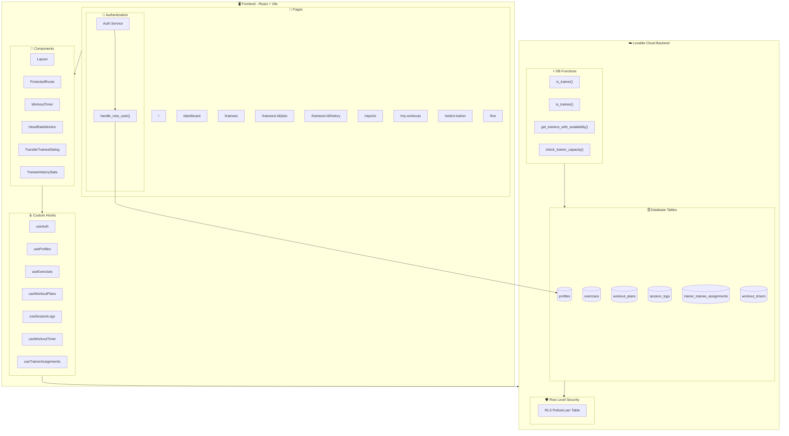
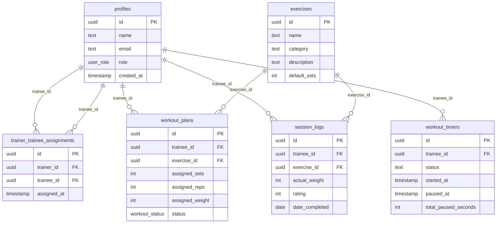
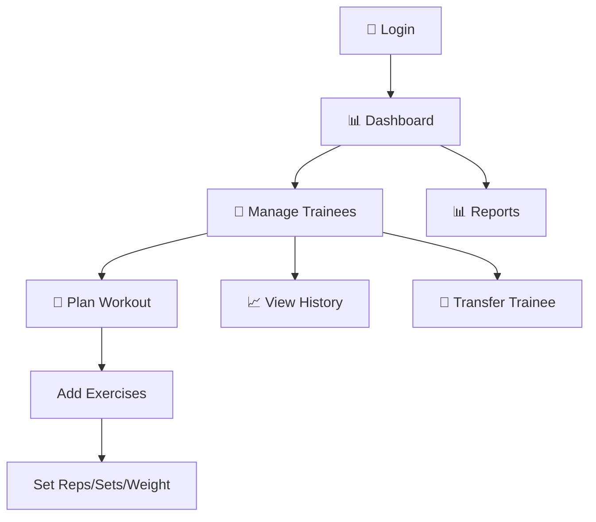
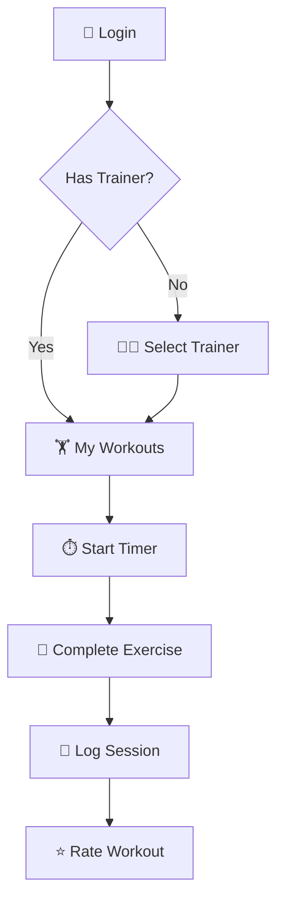
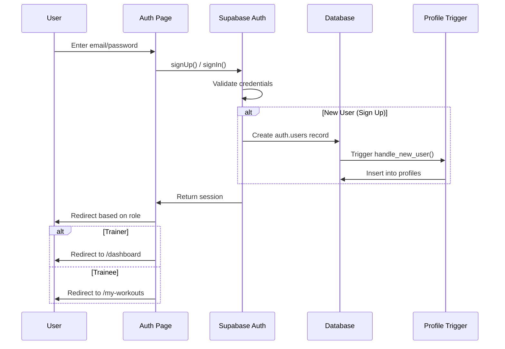
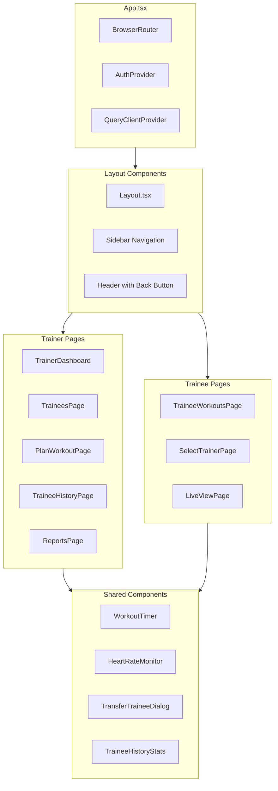
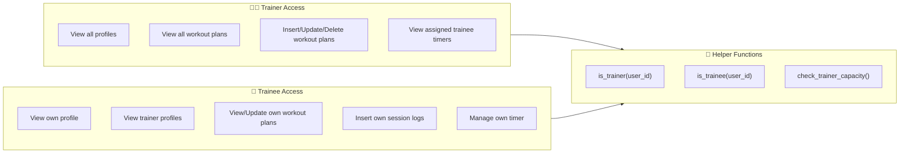

# 🏗️ Fitness Trainer App - Architecture Documentation

## 📋 Table of Contents
- [System Overview](#system-overview)
- [Database Schema (ERD)](#database-schema-erd)
- [User Flows](#user-flows)
- [Component Structure](#component-structure)
- [Technology Stack](#technology-stack)

---

## System Overview



---

## Database Schema (ERD)



### Table Details

| Table | Description | Key Fields |
|-------|-------------|------------|
| `profiles` | User accounts (trainers & trainees) | id, name, email, role |
| `exercises` | Exercise library | name, category, default_sets |
| `workout_plans` | Assigned workouts per trainee | trainee_id, exercise_id, sets/reps/weight |
| `session_logs` | Completed workout records | trainee_id, exercise_id, actual_weight, rating |
| `trainer_trainee_assignments` | Trainer-trainee relationships | trainer_id, trainee_id |
| `workout_timers` | Active workout session tracking | trainee_id, status, started_at |

---

## User Flows

### Trainer Flow



### Trainee Flow



### Authentication Flow



---

## Component Structure



---

## Technology Stack

| Layer | Technology | Purpose |
|-------|------------|---------|
| **Frontend** | React 18 | UI Framework |
| **Build Tool** | Vite | Fast development & bundling |
| **Styling** | Tailwind CSS | Utility-first CSS |
| **UI Components** | shadcn/ui | Pre-built accessible components |
| **State Management** | TanStack Query | Server state & caching |
| **Routing** | React Router v6 | Client-side routing |
| **Forms** | React Hook Form + Zod | Form handling & validation |
| **Backend** | Lovable Cloud (Supabase) | Database, Auth, Real-time |
| **Database** | PostgreSQL | Relational database |
| **Authentication** | Supabase Auth | User management |

---

## Security Model

### Row Level Security (RLS) Policies



---

## File Structure

```
src/
├── components/
│   ├── auth/
│   │   └── ProtectedRoute.tsx
│   ├── layout/
│   │   └── Layout.tsx
│   ├── ui/                    # shadcn components
│   ├── HeartRateMonitor.tsx
│   ├── WorkoutTimer.tsx
│   ├── TransferTraineeDialog.tsx
│   └── TraineeHistoryStats.tsx
├── contexts/
│   └── AuthContext.tsx
├── hooks/
│   ├── useExercises.ts
│   ├── useProfiles.ts
│   ├── useSessionLogs.ts
│   ├── useWorkoutPlans.ts
│   ├── useWorkoutTimer.ts
│   └── useTrainerAssignments.ts
├── integrations/
│   └── supabase/
│       ├── client.ts
│       └── types.ts
├── pages/
│   ├── AuthPage.tsx
│   ├── Index.tsx
│   ├── TrainerDashboard.tsx
│   ├── TraineesPage.tsx
│   ├── PlanWorkoutPage.tsx
│   ├── TraineeHistoryPage.tsx
│   ├── ReportsPage.tsx
│   ├── TraineeWorkoutsPage.tsx
│   ├── SelectTrainerPage.tsx
│   └── LiveViewPage.tsx
└── App.tsx
```

---

## Jira Integration

For linking commits to Jira issues, see [JIRA_CODE_LINKS.md](./JIRA_CODE_LINKS.md)

### Smart Commit Format
```
FIT-XXX #<action> <message>
```

### Actions
- `#comment` - Add comment to issue
- `#time` - Log time (e.g., `#time 2h`)
- `#close` / `#done` - Close the issue

---

*Last Updated: December 2024*
